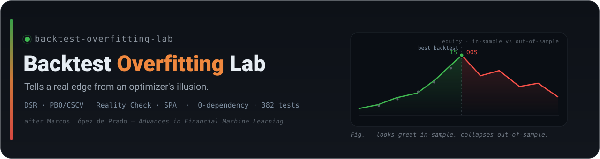
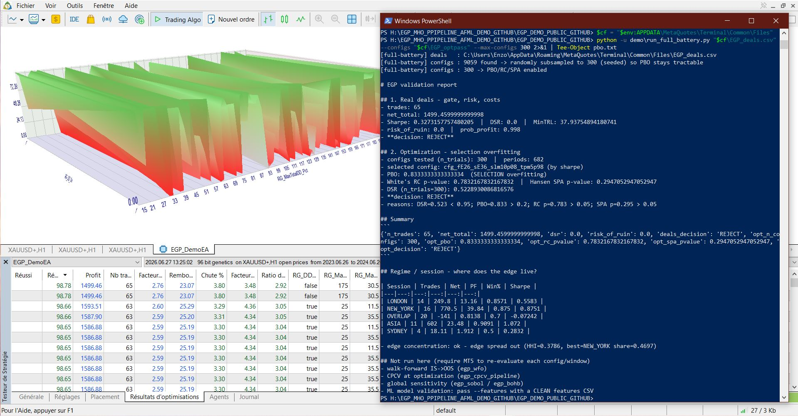

# Backtest Overfitting Lab


-9e9e9e)

-8957e5)


<!-- CI badge (activates after the first push): replace <OWNER>/<REPO> -->
<!--  -->

> A **pure-Python** (zero-dependency) pipeline to honestly appraise the "edge" of a trading strategy —
> and, more generally, of **any backtested or cross-validated model**: Deflated Sharpe Ratio (DSR),
> Probability of Backtest Overfitting (PBO/CSCV), White's Reality Check, Hansen's SPA, risk of ruin,
> Monte-Carlo. Inspired by Marcos López de Prado's *Advances in Financial Machine Learning* (2018). Ships with
> an **end-to-end synthetic demo** and **MQL5 modules** (a demonstration Expert Advisor + risk guards +
> an offline metaheuristic optimizer).
>
> The point is **not** the strategy — it is the **discipline**. Every result is reproducible (fixed
> seeds), auditable (a SHA-256 file manifest pins every shipped file) and dependency-free, with an
> automated test suite (**382 passing**) running on Linux, Windows and macOS. The same
> deflated-significance and overfitting controls transfer directly to **any** model-validation problem
> in regulated, data-intensive settings.

---

## Table of contents

- [Overview](#overview)
- [What it is — and what it is not](#what-it-is--and-what-it-is-not)
- [Repository layout](#repository-layout)
- [Quick start](#quick-start)
- [The end-to-end demo](#the-end-to-end-demo)
- [Running it on a real MT5 export](#running-it-on-a-real-mt5-export)
- [The arsenal (AFML coverage)](#the-arsenal-afml-coverage)
- [MQL5 modules](#mql5-modules)
- [Policy & confidentiality](#policy--confidentiality)
- [Portability](#portability)
- [Roadmap](#roadmap)
- [Contributing](#contributing)
- [License & disclaimer](#license--disclaimer)

---

## Overview

An optimizer (metaheuristic or grid) is an **overfitting machine**: left alone, it will always find
parameters that "shine" on historical data. The value of this repository is **defensive**: a battery
of statistical tests that acts as a **lie detector** on optimization results, to tell a plausible
edge apart from an artifact of over-fitting.

- **Pure Python, standard library only** (`random`, `math`, `csv`, `statistics`…) — no third-party
  dependency, for portability (including constrained environments such as MQL5).
- **52 modules** under `tools/`, **392 tests** (`382 passing`, `10 skipped` — see below).
- **Reproducible demo** (fixed seeds) exercising 4 pipeline paths end to end.
- **GitHub Actions CI** across **Linux, Windows and macOS** on Python 3.10 / 3.11 / 3.12.

### Design principles

The properties that make a validation result *trustworthy* are the same ones that matter in regulated,
data-intensive engineering — so they are built in, not bolted on:

- **Reproducible** — fixed seeds; the demo returns the same verdicts on every machine.
- **Auditable** — a SHA-256 `FILELIST_SHA256.txt` manifest pins every shipped file.
- **Dependency-free** — standard library only: nothing to vet, nothing to drift.
- **Tested** — 382 passing tests, including *negative* ("what must fail, fails") and look-ahead
  regression tests, not just happy-path checks.
- **Honest by construction** — on near-noise data the battery returns `REJECT`; it is built to refuse a
  non-existent edge rather than flatter it.
- **Traceable** — methodology notes in [`DOCS/SOURCES.md`](DOCS/SOURCES.md) reference the primary
  literature behind each test.

## What it is — and what it is not

| ✅ This repository provides | ❌ This repository does not provide |
|---|---|
| A tested AFML statistical-validation battery | A turnkey "profitable" strategy |
| An end-to-end synthetic demo | Real market data |
| A **demonstration MQL5 EA** (generic example strategy) | The author's production strategy (**intentionally private**) |
| Reusable MQL5 risk guards | Any financial or investment advice |

> ⚠️ **The demo EA (`EGP_DemoEA.mq5`) is an EXAMPLE strategy** (EMA crossover + RSI filter + ATR
> stops), meant only to produce deals/features to exercise the pipeline. It is **not** the author's
> real strategy, which is kept out of this public repository.

## Repository layout

```
backtest-overfitting-lab/
├── tools/                 # 52 pure-Python modules (AFML arsenal + MT5 bridges)
├── tests/                 # 54 test files (pytest)
├── demo/                  # end-to-end synthetic demo (run_demo.py) + real-export runner
├── MQL5/
│   ├── Experts/           # demo EA + .mqh modules (RiskGuard, DealsExport, Features, MHO)
│   └── Scripts/           # offline MHO demo (Differential Evolution)
├── DOCS/                  # methodology notes (sources, completeness)
├── assets/                # banner
├── .github/               # CI + issue/PR templates
└── (LICENSE, pyproject.toml, requirements*.txt, conftest.py, CONTRIBUTING.md, …)
```

## Quick start

> **Run everything from the repository root** — the folder that directly contains `demo/`, `tools/`
> and this `README.md`. If you used "Extract All" on the release zip, that is the folder named after
> the zip (it contains `demo/` and `tools/` directly). The scripts locate `tools/` on their own, but
> Python still needs the right path to the script — so `cd` into that folder first.

```bash
cd path/to/repo            # the folder that contains demo/ and tools/

# 1) REAL-DATA demo — auto-reads the EA's exports from MT5's Common\Files (no path to type):
python demo/run_real_demo.py

# 2) SYNTHETIC demo — no MetaTrader needed; proves all 4 pipeline paths:
python demo/run_demo.py

# 3) FULL BATTERY on a real export — ONE consolidated report (deflated gate + Monte-Carlo + costs +
#    regime/session fragility); add --configs for the PBO battery, --features for the model path:
python demo/run_full_battery.py

# 4) Tests (dev only):
python -m pip install -r requirements-dev.txt   # = pytest
python -m pytest -q                              # -> 382 passed, 10 skipped
```

**MetaTrader note:** only the MQL5 files (`MQL5/Experts/*.mq5`, `*.mqh`) need to be copied into your
terminal's `MQL5\Experts\` to compile in MetaEditor. The **Python repo runs from anywhere** — keep it
where you extracted it; do **not** run the Python from inside `MQL5\Experts\`.

## The end-to-end demo

`demo/run_demo.py` generates **coherent synthetic data** (fixed seeds) and exercises 4 paths:

| Path | Input → output | Result (reproducible) |
|---|---|---|
| **A** | prices → signals → model | `gate = REJECT` |
| **B** | MT5 deals → risk | `net≈3344.7`, `DSR=0.0`, `risk_of_ruin=0.0` → `REJECT` |
| **C** | optimization (30 configs) → PBO | `PBO≈0.33`, `RC≈0.41`, `SPA≈0.14` → `REJECT` |
| **D** | features → model | `model_adds_value = True` |

> The `REJECT`s are **intentional**: the demo data is near-noise. The battery correctly **refuses** a
> non-existent edge — that is exactly its job. On a real edge, PBO drops well below 0.5 and the DSR
> rises.

## Running it on a real MT5 export

After a Strategy Tester run, the EA writes `EGP_deals.csv` (and, optionally, `EGP_features.csv`) to
the terminal's `Common\Files` folder. The reproducible **real-data demo finds them automatically** —
no path to type, works in PowerShell/bash/zsh:

```bash
python demo/run_real_demo.py                       # auto-locates Common\Files\EGP_deals.csv
python demo/run_real_demo.py --deals MyEA_deals.csv    # any other EA's export (EA-agnostic)
```

### Windows PowerShell — copy-paste use cases

Reproducible verbatim. Point a variable at MetaTrader's shared `Common\Files` (where the EA writes its
exports), then list the options:

```powershell
$cf = "$env:APPDATA\MetaQuotes\Terminal\Common\Files"   # MT5 Common\Files (shared by all terminals)
python demo\run_full_battery.py --help                   # every option, explained
```

**Use case 1 — overfitting verdict over an optimization (PBO / CSCV / RC / SPA / DSR).**
During an *optimization* (local agents), the EA auto-captures one deals CSV per pass into
`Common\Files\EGP_optpass\`. `--max-configs` randomly subsamples (seeded) so the pure-Python battery
stays fast on thousands of passes; `-u` keeps the output unbuffered and `Tee-Object` writes it to the
console *and* a file:

```powershell
python -u demo\run_full_battery.py "$cf\EGP_deals.csv" --configs "$cf\EGP_optpass" --max-configs 300 2>&1 | Tee-Object pbo.txt
```

**Use case 2 — does the ML filter add value? (clean model validation).**
Run a *single* backtest (not an optimization) so `EGP_deals.csv` and `EGP_features.csv` come from the
**same** run and their positions match, then:

```powershell
python -u demo\run_full_battery.py "$cf\EGP_deals.csv" --features "$cf\EGP_features.csv" 2>&1 | Tee-Object clean.txt
```

Real run — the PBO battery on an optimization of 9059 passes (subsampled to 300):



Explicit path (single backtest):

```bash
python demo/run_on_mt5_export.py "PATH/EGP_deals.csv" --features "PATH/EGP_features.csv"
```

The runner detects an accumulated features file (appended across runs) and skips the model path in
that case, rather than producing a misleading join.

The **overfitting test (path C)** over many configurations needs **one deals file per config**, not a
single backtest. The demo EA does this **automatically**: during an *optimization* (local agents),
`OnTester()` (one call per pass) writes `Common\Files\EGP_optpass\cfg_<params>.csv` — one file per pass
— so you point `--configs` straight at that folder (Use case 1 above). For an **EA-agnostic**
alternative (arbitrary per-config CSVs you collected yourself), `collect_pbo.py` runs the same battery;
full step-by-step is in
[`demo/README.md`](demo/README.md#path-c-the-overfitting-test-pbocscv-on-real-configs):

```bash
python demo/collect_pbo.py "PATH/configs_folder"   # one deals CSV per config -> PBO / RC / SPA / DSR
```

## The arsenal (AFML coverage)

Grouped by theme — the **full per-module map** is in the table below.

- **Significance, deflation & multiple-testing**: Deflated Sharpe (DSR), Expected-Maximum Sharpe,
  PBO/CSCV, White's Reality Check, Hansen's SPA, FDR, always-valid sequential tests.
- **Cross-validation & walk-forward** (out-of-sample): purged K-Fold, nested CV, combinatorial purged
  CV (CPCV), rolling walk-forward (IS→OOS), cross-symbol/segment generalization.
- **Labeling, weights & features**: triple-barrier, meta-labeling, sample uniqueness/weights,
  sequential bootstrap, fractional differentiation, ADF auto-lag, feature importance (MDI/MDA/clustering).
- **Sizing & risk**: bet sizing, fractional-Kelly + volatility targeting, risk of ruin, Monte-Carlo,
  cost models (spread/overnight).
- **Regime & structure**: edge localization (session/hour/day/volatility), structural-break detection.
- **Metaheuristics** (offline, **wrapped** by the battery): DE, CMA-ES, NSGA-II, TPE, BOHB, Sobol, Hyperband.
- **MT5 bridges**: parsing of exported deals (filtering balance operations), reconstruction of trades
  per position, HTML report parser, end-to-end runner.

### Full module map (`tools/`, 52 modules)

Each role is the module's own one-line purpose. AFML = *Advances in Financial Machine Learning*
(López de Prado, 2018); MLAM = *Machine Learning for Asset Managers* (2020).

**Significance, deflation & gates** — the verdict engine

| Module | Role |
|---|---|
| `egp_accept_gate` | Deflated acceptance gate: DSR, Expected-Maximum Sharpe, **PBO/CSCV**, White's Reality Check, Hansen's SPA. |
| `egp_fdr` | False Discovery Rate control (multiple testing). |
| `egp_sequential` | "Always-valid" sequential tests for live monitoring. |
| `egp_final_gate` | Thin final pass/fail gate. |
| `egp_real_gate` | REAL MT5 deals → AFML verdict (deflated gate + Monte-Carlo + costs). |

**Cross-validation & walk-forward** — out-of-sample / anti-overfitting

| Module | Role |
|---|---|
| `egp_cpcv` | Combinatorial Purged Cross-Validation (CPCV). |
| `egp_cpcv_model` | CPCV at the MODEL level (forest + bet sizing) → paths → deflated. |
| `egp_cpcv_pipeline` | CPCV → optimization (walk-forward style) → deflated-gate wiring. |
| `egp_nested_cv` | Nested purged CV for hyperparameter tuning (AFML ch.7). |
| `egp_cv_importance` | Purged K-Fold CV (ch.7) + MDA/SFI feature importance (ch.8). |
| `egp_wfo` | Walk-forward harness: rolling IS→OOS optimization. |
| `egp_opt_validation` | Closes the optimization → validation loop. |
| `egp_ensemble` | Cross-segment/cross-symbol generalization + parameter ensembles. |

**Labeling, weights & features** — AFML ch.3–5

| Module | Role |
|---|---|
| `egp_triple_barrier` | Triple-barrier labeling (ch.3), volatility-aware. |
| `egp_meta_model` | Secondary META-LABELING model (ch.3). |
| `egp_sample_weights` | Sample weights / uniqueness (ch.4). |
| `egp_seq_bootstrap` | Sequential bootstrap (ch.4.5). |
| `egp_fracdiff` | Fixed-width fractional differentiation FFD (ch.5). |
| `egp_features` | Market feature stack aligned on events. |

**ML models & feature importance** — AFML ch.6–8

| Module | Role |
|---|---|
| `egp_tree_forest` | CART tree + Random forest (ch.6 bagging, ch.8 MDI). |
| `egp_cluster_importance` | Clustered feature importance / cMDA (MLAM ch.6). |
| `egp_calibration` | Probability calibration (Platt, isotonic/PAVA, Brier score). |

**Sizing, risk & costs** — AFML ch.10

| Module | Role |
|---|---|
| `egp_montecarlo` | Monte-Carlo over the trade SEQUENCE: drawdown + risk of ruin. |
| `egp_sizing` | Robust position sizing (fractional Kelly + volatility targeting). |
| `egp_bet_sizing` | Bet sizing (ch.10). |
| `egp_costs` | Transaction-cost model + cost-robustness stress test. |
| `egp_strategy_backtest` | Concurrency-aware backtest of the SIZED strategy → gate. |

**Stationarity, regime & structure**

| Module | Role |
|---|---|
| `egp_adf` | Augmented Dickey-Fuller unit-root test. |
| `egp_regime` | Where does the edge live? (session, hour, day, volatility regime). |
| `egp_structural` | Structural break / regime-change detection. |

**Search / optimization** — offline metaheuristics, wrapped by the battery

| Module | Role |
|---|---|
| `egp_mho_hybrid` | MHO hybrid self-adaptive optimizer (deterministic when seeded). |
| `egp_mho_generate` | Candidate generation driven by the metaheuristic. |
| `egp_meta_algos` | Metaheuristic kernels (DE, CMA-ES, NSGA-II, TPE, …). |
| `egp_sobol` | Global sensitivity analysis (Sobol indices). |
| `egp_bohb` | BOHB (Bayesian Optimization + HyperBand), multi-fidelity. |
| `egp_core_select` | Search-space reduction (core). |

**Orchestration & reports** — entry points

| Module | Role |
|---|---|
| `egp_full_report` | THE single command: runs the whole battery → ONE report. |
| `egp_diagnostic_report` | Consolidated diagnostic orchestrator (single auditable report). |
| `egp_runner` | Config-driven pipeline orchestrator + reproducible manifest. |
| `egp_real_pipeline` | ML-model validation on REAL data (features↔deals join). |

**MT5 bridge**

| Module | Role |
|---|---|
| `egp_mt5_deals` | MT5 deal series → per-trade P&L series. |
| `egp_mt5_collect` | Collect / inspect MT5 export CSVs (plumbing). |
| `egp_mt5_report_parser` | Parser for MT5 Strategy Tester HTML reports (offline). |

**MQL5 code generation** (Python → `.mqh`) and testable mirrors

| Module | Role |
|---|---|
| `egp_deals_export_codegen` | Generates `EGP_MHO_DealsExport.mqh`. |
| `egp_features_export_codegen` | Generates `EGP_MHO_FeaturesExport.mqh` (template). |
| `egp_ontester_codegen` | Generates `EGP_MHO_OnTester.mqh` (self-optimization hook). |
| `egp_risk_guard_codegen` | Generates `EGP_MHO_RiskGuard.mqh` (4 guards). |
| `egp_risk_guard_logic` | Pure-Python logic of the 4 EA guards (testable mirror). |

**Internal utilities**

| Module | Role |
|---|---|
| `egp_bt_cache` | Backtest cache + canonical candidate key (deduplication). |
| `egp_enum_tables` | Verified enumeration tables for correct MT5 `.set` files. |
| `egp_set_tools` | `.set` file tooling. |
| `egp_static_audit` | Static source/package audit. |

## MQL5 modules

| File | Role |
|---|---|
| `MQL5/Experts/EGP_DemoEA.mq5` | **Demonstration EA**: EMA crossover + RSI + ATR stops (EXAMPLE strategy). Wires the modules below. |
| `MQL5/Experts/EGP_MHO_RiskGuard.mqh` | Risk guards: drawdown circuit-breaker, position cap, risk-based sizing (ATR, gold-safe), break-even, news blackout. |
| `MQL5/Experts/EGP_MHO_DealsExport.mqh` | CSV export of deals at end of test (format consumed by the Python pipeline). |
| `MQL5/Experts/EGP_MHO_FeaturesExport.mqh` / `…FeaturesExample.mqh` | Per-position feature logging (no look-ahead, closed bar). Resets the file at each run for clean alignment. |
| `MQL5/Experts/EGP_MHO_Optimizer.mqh` | **MHO**: Differential Evolution (DE/rand/1/bin), **offline only**. |
| `MQL5/Scripts/EGP_MHO_Demo.mq5` | Offline MHO demonstration on a test function (sphere) — no market operation. |

> MT5 API verified against the official documentation (`CTrade`, `iMA/iRSI/iATR`, `CopyBuffer`).
> **Code is not compiled in this repository** (no MetaEditor in CI): compile it in MetaTrader 5.

## Policy & confidentiality

Non-negotiable rules for the MQL5 modules:

1. **No MHO in `OnTick()`.** Optimization is **offline** only.
2. **No live mutation** of a running EA's parameters.
3. **No automatic promotion**: any configuration coming out of optimization must **pass the battery**
   (DSR / PBO / Reality Check / SPA) before any use.
4. **Production strategy kept private**: the real EA and its proprietary indicators are
   **intentionally excluded** from this public repository.

## Portability

- **Zero third-party runtime dependency** (Python standard library only) — verified.
- **Explicit UTF-8 encoding** on every text file read/write — no locale-dependent failures on Windows.
- **Path handling is cwd-independent** (`__file__`-based) — run scripts from anywhere.
- **CI matrix proves it**: the suite + the demo run on **Linux, Windows and macOS** × Python
  3.10/3.11/3.12.

## Roadmap

- [x] AFML validation arsenal (pure-Python, tested).
- [x] End-to-end synthetic demo.
- [x] MQL5 modules: demo EA + risk guards + deals/features export + offline MHO.
- [x] Repository hygiene: CI (3 OS), templates, license, banner.
- [x] Pipeline exercised on a real MT5 export (deals → gate path).
- [ ] (Private) Integration of the production EA and its indicators.
- [ ] Real MT5 backtests (passes A/B + optimization) and pipeline on real CSVs.

## Contributing

See [`CONTRIBUTING.md`](CONTRIBUTING.md). In short: no third-party dependency in `tools/`, every logic
change ships with a test, every formula/API is sourced, and the MQL5 policy above is respected.

## License & disclaimer

**License**: proprietary — **© 2026 SOVRALYS LLC — Enzo C. Di Bacco (KinSushi). All rights reserved.**
See [`LICENSE`](LICENSE). Published as a public work sample: viewing and evaluation are welcome; any
reuse, redistribution or modification requires the prior written consent of SOVRALYS LLC.

**Disclaimer**: this repository is a **research and statistical-validation** tool. It is **not**
financial, accounting or investment advice. Trading carries a risk of capital loss. Past performance
does not guarantee future results.

---

### Note on the 10 "skipped" tests

This public repository **intentionally excludes** the production EA and its parameter map
(`PARAMETER_MAP`). The 10 tests that audit that specific machinery (candidate generation, "protected"
gates, codegen against the real EA) are therefore **skipped with an explicit reason**. They run in the
private environment where the real EA is present. The remaining **382 tests** cover the entire generic
arsenal and pass.

---

*Part of a broader body of work on reproducible, auditable and well-tested data/ML engineering —
[github.com/KinSushi](https://github.com/KinSushi).*
